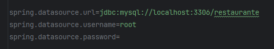
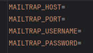
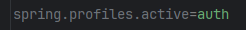
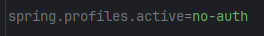
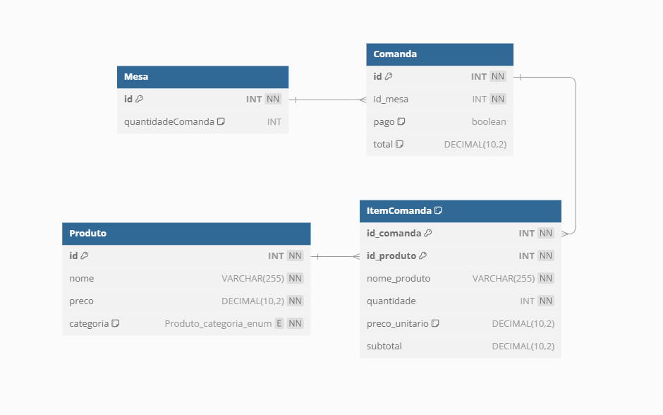

# RestauranteBack


## Descrição

Este é o back end de um projeto para gestão de restaurantes

É uma Api Rest com o principal objetivo de gerenciar as comandas e seu itens relacionados, utilizando métodos http e consultando num banco de dados

Visualize o front end [aqui](https://github.com/Gustavoksbr/RestauranteFront)

O projeto completo (back, front e ux design) foi desenvolvido por uma equipe no Azure DevOps, utilizando a metodologia ágil Scrum

## Dependências
Instale:
- Java 17
- Mysql

Tenha uma conta no [mailtrap](https://mailtrap.io/) para envio de emails (opcional)

## Passo a passo para rodar a API


1. Clone o repositório para a sua máquina local:
    ```bash
    git clone https://github.com/Gustavoksbr/RestauranteBack.git
    ```

2. Navegue até o diretório do projeto:
    ```bash
    cd RestauranteBack
    ```
3. Execute este comando para criar os arquivos com dados sensíveis:
    ```bash
   .\copy_examples.sh
    ```
4. Abra o arquivo `src/main/resources/aplication.properties` e preencha com os seus dados. Deixei por padrão assim:
   

-Caso você queira testar 2 fatores, crie uma conta no [mailtrap](https://mailtrap.io/), abra `src/main/resources/.env` e preencha com os dados do seu inbox


5. Crie um banco de dados no Mysql com o nome que você definiu no arquivo `src/main/resources/aplication.properties` e deixe o MySQL rodando

6. Execute o comando para construir o projeto com Gradle:
    ```bash
    gradlew build
    ```

7. Execute a aplicação:
    ```bash
    gradlew bootRun
    ```

8. Acesse a API através do endereço `http://localhost:8080` com suas respectivas rotas num cliente http (como o Postman) e faça as requisicões em [casos de uso](#casos-de-uso)


* obs: você pode escolher usar autenticação de usuário ou não, basta setar a variável spring.profiles.active no arquivo `src/main/resources/application.properties`:

Autenticacao ativada:


Autenticacao desativada:


Lembrando que, com a autenticação ativada, voce deve passar o token de autenticação no header de todas as requisicões dos [casos de uso](#casos-de-uso)

Para adquirir um token, você precisa de [autenticacao](#autenticacao)

## Modelagem



<a id="casos-de-uso"></a>
## Casos de Uso

### 1. Listagem de Mesas

- GET `http://localhost:8080/mesa`
- Sem json request
- **Exemplo de Json Response:**
```json
[
    {
        "id": 1,
        "quantidadeComandas": 3
    },
    {
        "id": 2,
        "quantidadeComandas": 0
    },
    {
        "id": 3,
        "quantidadeComandas": 1
    },
    {
        "id": 4,
        "quantidadeComandas": 2
    }
]
```
### 2. Listagem de Produtos


- GET `http://localhost:8080/produto`
- Sem json request
- **Exemplo de Json Response:**
```json
[
    {
        "nome": "bombom",
        "categoria": "sobremesa",
        "precoUnitario": 3
    },
    {
        "nome": "lasanha",
        "categoria": "prato",
        "precoUnitario": 20
    }
]
```

### 3. Listagem de Comandas não pagas de uma Mesa

- GET `http://localhost:8080/mesa/{id}/comanda`
- Sem json request
- **Exemplo de Json Response:**
```json
[
{
  "id": 2,
  "total": 5.50
},
{
  "id": 5,
  "total": 90.00
},
{
  "id": 7,
  "total": 38.00
}
]
```

### 4. Listagem de Itens de uma Comanda


- GET `http://localhost:8080/comanda/{id}/itemcomanda`
- Sem json request
- Exemplo de Json Response:
```json
    [
        {
            "nomeProduto": "bombom",
            "precoUnitario": 3,
            "quantidade": 4,
            "precoTotal": 12
        },
        {
            "nomeProduto": "lasanha",
            "precoUnitario": 20,
            "quantidade": 1,
            "precoTotal": 20
        }
    ]
```


### 5. Criar Comanda

-  POST `http://localhost:8080/mesa/{id}/comanda`

### 6. Criar Item na Comanda

- POST `http://localhost:8080/comanda/{id}/itemcomanda`
- Exemplo de Json Request:
```json
    [
        {
          "nomeProduto": "bombom",
          "quantidade": 4
        },
        { 
          "nomeProduto": "lasanha",
           "quantidade": 1
        }
    ]
```
- Sem json authResponse

### 7. Apagar Item da Comanda

- DELETE `http://localhost:8080/itemcomanda/{idcomanda}/{nomeproduto}`

### 8. Apagar Comanda da Mesa

- DELETE `http://localhost:8080/comanda/{id}`

### 9. Pagar Comanda

- PATCH `http://localhost:8080/comanda/{id}`

<a id="autenticacao"></a>
## Autenticação

### 1. Cadastro de Usuário
- POST `http://localhost:8080/cadastro`
- Exemplo de Json Request:
```json
{
    "username": "gustavo",
    "email": "gustavo@email.com",
    "password": "123"
}
```
- Exemplo de Json Response:
```json
    {
        "token":"um_monte_de_caracteres"
    }
```


### 2. Login
- POST `http://localhost:8080/login`
```json
{
    "username": "gustavo",
    "password": "123"
}
```
- Exemplo de Json Response:

-Se não tiver 2fa ativado:
```json
    {
      "token":"um_monte_de_caracteres"
    }
```
-Se tiver 2fa ativado:
```json
{
    "username":"gustavo",
    "password":"123"
}
```

### 3. Login 2fa

- Contexto: depois do usuário fazer login e se ele tiver 2fa ativado
*   POST `/login2fa`
*   Exemplo de Json Request
```json
  
  {
    "username": "henrique",
    "password":"123",
    "codigo":"247363"
  }
  
```
*   Exemplo de Json Response
```json
  
{
    "token": "um_monte_de_caracteres"
}
  
```
### 4. Ativar/desativar 2fa
*   PATCH `/usuario/doisfatores`
*   Exemplo de Json Response
```
    true
```
obs: ativa se estava desativado (retornando true), e desativa se estava ativado (retornando false)

## Detalhes Técnicos

### Arquitetura

- Utilizada arquitetura hexagonal
- Dividido entre a camada de domínio (models, casos de uso e portas) e a camada da aplicação (controllers e persistencia)
- Os métodos dos services refletem os métodos dos controllers. Já os métodos dos repositories refletem a sua respectiva entidade
- Justificativa: prepara o projeto para possíveis mudanças de tecnologias e adicões de funcionalidades. Por exemplo, foi adicionado autenticação de usuários e serviço de envio de emails

### Ordem dos processos de cada caso de uso
- Controller -> ServicePort -> ServiceImpl -> RepositoryPort -> RepositoryImpl -> JpaRepository

### Exceptions
- O projeto possui exceções personalizadas para cada 4xx status code (erro do cliente)

### Dependências específicas

- Jpa para persistência
- Spring Security para autenticação de usuários
- Spring Mail para envio de emails
